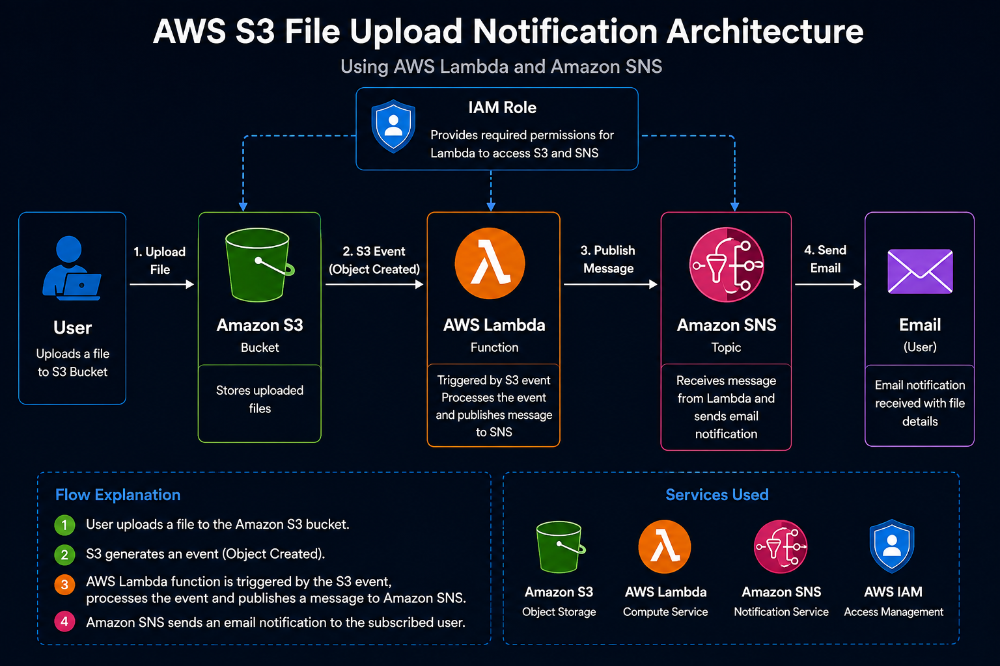
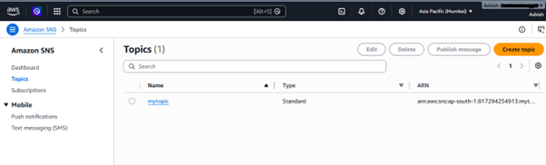
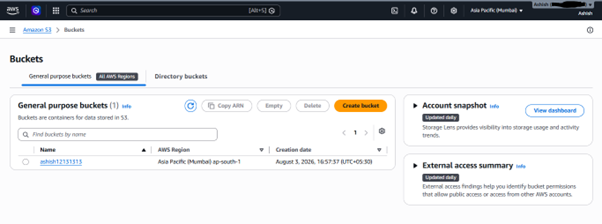
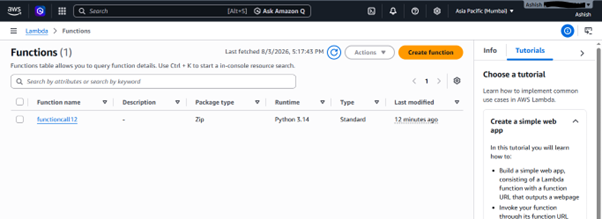
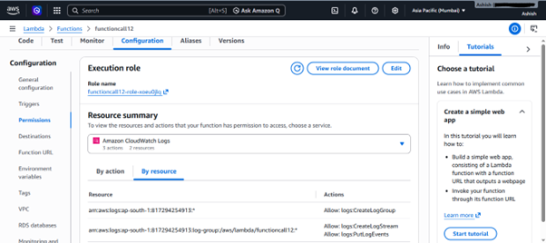
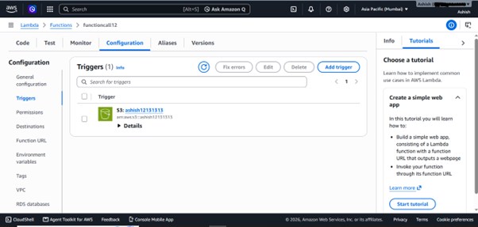
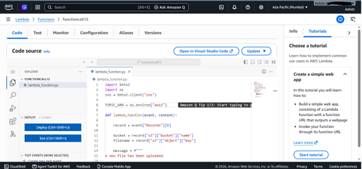
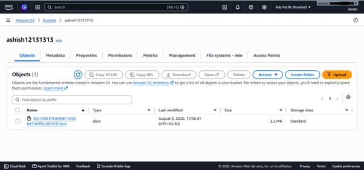
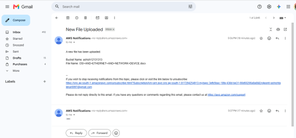

# AWS Lambda S3 Upload Notification

## Project Description

This project demonstrates an event-driven serverless application using AWS Lambda, Amazon S3, and Amazon SNS. It covers the complete workflow of creating an Amazon S3 bucket, configuring an AWS Lambda function, setting up Amazon SNS notifications, assigning IAM permissions, configuring S3 Event Triggers, and automatically sending email notifications whenever a new file is uploaded to the S3 bucket.

---

## Project Objective

The objective of this project is to gain practical hands-on experience in building an event-driven serverless application using AWS services. The project demonstrates automatic event processing, cloud automation, secure access management, and real-time notification delivery without managing any servers.

---

## AWS Services Used

- AWS Lambda
- Amazon S3
- Amazon SNS
- AWS IAM
- IAM Execution Role
- Environment Variables
- Amazon S3 Event Trigger
- Amazon CloudWatch

---

## Project Features

- Created Amazon SNS Topic
- Configured Email Subscription
- Created Amazon S3 Bucket
- Developed AWS Lambda Function using Python
- Configured Environment Variables
- Assigned IAM Execution Role
- Configured Amazon S3 Event Trigger
- Automatically Processed File Upload Events
- Sent Real-Time Email Notifications
- Monitored Lambda Execution using CloudWatch

---

## Project Architecture

The project follows an event-driven serverless architecture where an Amazon S3 bucket generates an Object Created event whenever a file is uploaded. The event automatically invokes an AWS Lambda function, which processes the event details and publishes a notification to Amazon SNS. Amazon SNS then sends an email notification to the subscribed user.

### Architecture Diagram

---

## Project Workflow

1. Create Amazon SNS Topic
2. Configure Email Subscription
3. Create Amazon S3 Bucket
4. Create AWS Lambda Function
5. Configure Environment Variables
6. Assign IAM Execution Role
7. Configure Amazon S3 Event Trigger
8. Upload Lambda Python Code
9. Upload File to Amazon S3
10. Receive Email Notification via Amazon SNS

---

## Project Documentation

Complete project documentation with screenshots and detailed explanations is available in the **Documentation** folder.

---

## Lambda Source Code

The complete AWS Lambda Python source code is available in the **Lambda-Code.py** file.

---

## Configuration

Configuration details for Amazon SNS, IAM Role, Environment Variables, Lambda Trigger, and Amazon S3 are available in the project documentation.

---

# Project Screenshots

## 1. Amazon SNS Topic Created

---

## 2. Amazon S3 Bucket Created

---

## 3. AWS Lambda Function Created

---

## 4. IAM Execution Role

---

## 5. Amazon S3 Event Trigger

---

## 6. Lambda Python Source Code

---

## 7. Upload File to Amazon S3

---

## 8. Email Notification Received

---

## Repository Contents

- 📄 Project Documentation → `Documentation/`
- 🖼️ Project Screenshots → `Screenshots/`
- 🏗️ Architecture Diagram → `Architecture/`
- 🐍 Lambda Source Code → `Lambda-Code.py`
- ⚙️ AWS Configuration → `Documentation/`

---

## Skills Demonstrated

- AWS Lambda
- Amazon S3
- Amazon SNS
- AWS IAM
- IAM Execution Role
- Event-Driven Architecture
- Serverless Computing
- Python (Boto3)
- Environment Variables
- Amazon CloudWatch
- Cloud Automation
- Email Notification Services

---

## Author

**Ashish J Talekar**

AWS Cloud | Linux Administration | Networking

GitHub: https://github.com/Ashish-Talekar

LinkedIn: https://www.linkedin.com/in/ashish-talekar/

---

## License

This project is licensed under the MIT License.
